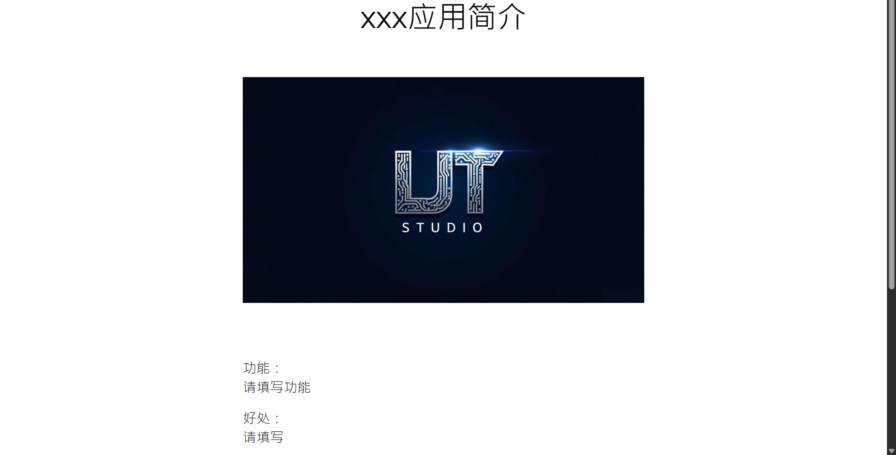

# 🎨 Wex - WordPress Theme

**Version:** 1.2.0  
**Author:** LJT
**Author URI:** [https://tedlijunyu.top](https://tedlijunyu.top)  
**License:** MIT  
**Requires at least:** WordPress 6.0  
**PHP Version:** 7.4+

---

## 📌 Description

Wex is a lightweight modern WordPress theme designed specifically for displaying applications and works. We support block editors, responsive design, and easy customization.

---

## ✨ Features

- ✅ Full Site Editing (FSE) support
- ✅ Responsive layout for mobile, tablet, and desktop
- ✅ Custom logo, menu, and background support
- ✅ Built-in block patterns and templates
- ✅ Featured images and post formats support
- ✅ Compatible with popular plugins (e.g., WooCommerce, Contact Form 7)
- ✅ Clean and developer-friendly code structure

---

## 🚀 Installation

1. Download the theme file.
2. Go to your WordPress Admin Panel → Appearance → Themes → Add New → Upload Theme.
3. Choose the ZIP file and click "Install Now".
4. After installation, click "Activate".

---

## 🛠️ Development

To customize the theme:

- Open the block editor and edit it!

---

## 📁 File Structure
wex/
├── index.php
├── style.css
├── functions.php
├── template-parts/
├── templates/
├── assets/
│   ├── css/
│   ├── js/
│   └── images/
├── theme.json
└── README.md

---

## 📄 License

This theme is licensed under the **MIT License**.  
See the [LICENSE](LICENSE) file for more details.

---

## 📬 Support

If you have any questions or suggestions, feel free to contact me:

- Email: ted-lijunyu@foxmail.com
- Website: [https://tedlijunyu.top](https://tedlijunyu.top)
- Blog : [https://blog.ted-lijunyu.top](https://blog.ted-lijunyu.top)

---

## 🙏 Credits

- [WordPress](https://wordpress.org)

---

## 📷 Screenshot

##  👏  Appreciation and support

- Can you give me a bread？ 

